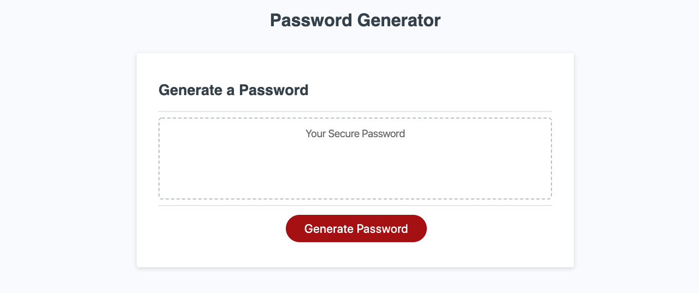

### Project Name

# Password Generator



> This application allows you to randomly generate a new password.

---

### Table of Contents

Your section headers will be used to reference location of destination.

- [Description](#description)
- [How To Use](#how-to-use)
- [References](#references)
- [License](#license)
- [Contributors](#contributors)

---

## Description

This password generator randomly generates passwords based on user criteria.  User first chooses the number of characters the password should contain between 8 and 128.  Then the user chooses the character types (lowercase, uppercase, numbers and/or special characters) to be included in the new password.  

Once all options are decided a new random password will be generated.

#### Technologies

- HTML 5
- CSS 3
- Javascript

---

## How To Use

To begin click the 'Generate Password' button, then follow the prompts.

All functionality is javascript based.

#### Installation

#### API Reference

```html
<p>dummy code</p>
```

[Back To The Top](#project-name)

---

## References

[Back To The Top](#project-name)

---

## License

Copyright (c) [2020][nate valline]

[Back To The Top](#project-name)

---

## Authors

- Nate Valline

[Back To The Top](#project-name)

